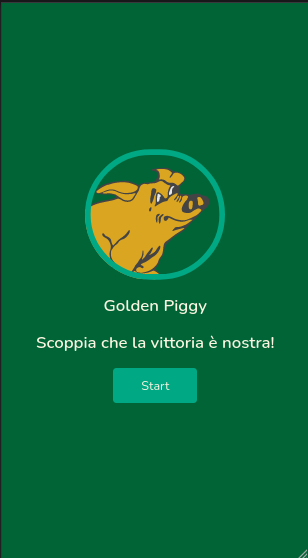
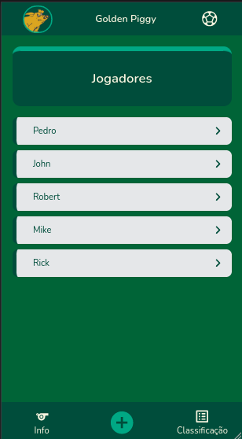
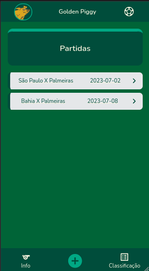
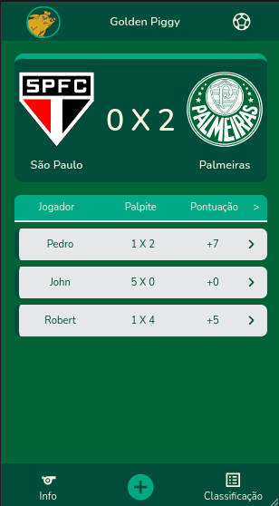

# Golden Piggy

## Índice

- [Descrição](https://github.com/pedro-rampazo/golden_piggy#descrição)
- [Status do Projeto](https://github.com/pedro-rampazo/golden_piggy#status-do-projeto)
- [Funcionalidades](https://github.com/pedro-rampazo/golden_piggy#funcionalidades)
- [Acesso ao Projeto](https://github.com/pedro-rampazo/golden_piggy#acesso-ao-projeto)
- [Tecnologias Utilizadas](https://github.com/pedro-rampazo/golden_piggy#tecnologias-utilizadas)
- [Pessoas Contribuidoras](https://github.com/pedro-rampazo/golden_piggy#pessoas-contribuidoras)
- [Conclusão](https://github.com/pedro-rampazo/golden_piggy#conclusão)

## Descrição

*Golden Piggy* é um jogo de palpites de partidas de futebol desenvolvido em HTML, CSS e JavaScript. Esse projeto foi desenvolvido como trabalho final na disciplina de Desenvolvimento Web I no Instituto Federal de São Paulo (IFSP) em Junho de 2023

## Status do Projeto

O projeto encontra-se incompleto, não possuindo perspectiva de retomada, esse projeto servirá para a construção de outro projeto com o mesmo escopo, mas mantendo uma consistência e funcionalidade melhor.

## Funcionalidades

Nesse projeto é possível o cadastro de jogadores participantes do jogo, cadastro de partidas e palpites por partidas. Funcionalidades de acúmulo de pontos e classificação de jogadores não foram finalizadas, portanto, não funcionais. O projeto foi desenvolvido no conceito *Mobile First*, não tendo o desenvolvimento adaptado para outros dispositivos, sendo aconselhável resoluções de dispositivos Mobile para melhor experiência

## Acesso ao projeto

[Golden Piggy Project](https://pedro-rampazo.github.io/golden_piggy/html/home.html)

## Tecnologias Utilizadas

#HTML | #CSS | #JavaScript | #GoogleFonts | #GitHubPages

## Pessoas Contribuidoras

Pedro Rampazo - Criador e desenvolvedor do projeto

## Conclusão

Esse projeto teve uma importância fundamental em algumas áreas de exploração no momento de sua criação: 1. A entrega de um projeto como aplicação de conhecimentos adquiridos nas aulas de Desenvolvimento Web I, 2. Reforçar conhecimentos de #JavaScript não colocados em prática, dessa forma, pude solidificar todo o conhecimento, 3. O projeto serviu como um ponto de partida para o desenvolvimento de um mesmo projeto futuro, porém com ideias bem definidas e garantindo a funcionalidade completa.
